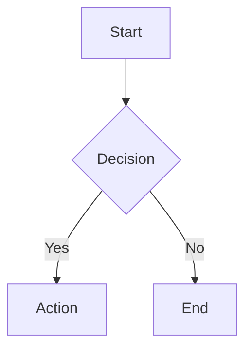

# Components

Chronicle provides built-in MDX components that enhance standard markdown with interactive elements and styled content.

## Callout

Callouts highlight important information with colored boxes.

### Directive Syntax

Use `:::` fenced directives in your MDX files:

```mdx
:::note
This is a note callout.
:::

:::tip
Helpful tip for users.
:::

:::warning
Be careful with this operation.
:::

:::danger
This action is irreversible.
:::

:::success
Operation completed successfully.
:::
```

### Directive Types

| Directive | Callout Type | Color |
|-----------|-------------|-------|
| `:::note` | `accent` | Blue |
| `:::tip` | `accent` | Blue |
| `:::info` | `accent` | Blue |
| `:::warn` | `attention` | Yellow |
| `:::warning` | `attention` | Yellow |
| `:::danger` | `alert` | Red |
| `:::caution` | `alert` | Red |
| `:::success` | `success` | Green |

### JSX Syntax

For more control, use the `Callout` component directly:

````mdx
<Callout type="accent">
  <CalloutTitle>Note</CalloutTitle>
  <CalloutDescription>This is a custom callout with title and description.</CalloutDescription>
</Callout>
````

**Callout Props**

| Prop | Type | Default | Description |
|------|------|---------|-------------|
| `type` | `'accent' \| 'attention' \| 'alert' \| 'success' \| 'grey'` | `'grey'` | Callout color variant |
| `outline` | `boolean` | `false` | Use outline style |
| `width` | `string` | — | Custom width |
| `className` | `string` | — | Additional CSS class |

## Tabs

Tabbed content panels using Apsara's `Tabs` component.

````mdx
<Tabs defaultValue="npm">
  <Tabs.List>
    <Tabs.Tab value="npm">npm</Tabs.Tab>
    <Tabs.Tab value="bun">bun</Tabs.Tab>
  </Tabs.List>
  <Tabs.Content value="npm">

    ```bash
    npm install @raystack/chronicle
    ```

  </Tabs.Content>
  <Tabs.Content value="bun">

    ```bash
    bun add @raystack/chronicle
    ```

  </Tabs.Content>
</Tabs>
````

## Badge

Small inline labels for status, counts, or categories. Renders as a `<span>`, so it works inline in prose, headings, table cells, and list items.

````mdx
<Badge>Default</Badge>
<Badge variant="success">Stable</Badge>
<Badge variant="warning">Beta</Badge>
<Badge variant="danger">Deprecated</Badge>
<Badge variant="neutral">Internal</Badge>
<Badge variant="gradient">New</Badge>

### Rate limits <Badge variant="warning" size="micro">Beta</Badge>

The `POST /users` endpoint <Badge variant="danger" size="micro">Deprecated</Badge> is removed in v3.
````

Badges work inside headings too. The table of contents lists such a heading by
its plain text, so `### Rate limits <Badge>Beta</Badge>` shows as "Rate limits Beta".

**Badge Props**

| Prop | Type | Default | Description |
|------|------|---------|-------------|
| `variant` | `'accent' \| 'warning' \| 'danger' \| 'success' \| 'neutral' \| 'gradient'` | `'accent'` | Color variant |
| `size` | `'micro' \| 'small' \| 'regular'` | `'small'` | Badge size |
| `icon` | `ReactNode` | — | Icon or emoji rendered before the label |
| `screenReaderText` | `string` | — | Extra context announced by screen readers |
| `className` | `string` | — | Additional CSS class |

Emoji work as icons without an import:

````mdx
<Badge icon="🔥" variant="danger">Hot path</Badge>
````

## Avatar

User or entity images with a text fallback.

````mdx
<Avatar src="/team/ada.png" alt="Ada Lovelace" fallback="AL" size={5} />
<Avatar fallback="RS" size={5} color="indigo" variant="soft" />
<Avatar fallback="RS" size={5} radius="full" />
````

**Avatar Props**

| Prop | Type | Default | Description |
|------|------|---------|-------------|
| `src` | `string` | — | Image URL |
| `alt` | `string` | — | Alternative text for the image |
| `fallback` | `ReactNode` | — | Shown while loading or when `src` is missing |
| `size` | `1`–`13` | `3` | Avatar size step |
| `variant` | `'solid' \| 'soft'` | `'soft'` | Fallback fill style |
| `color` | `'indigo' \| 'neutral' \| 'cyan' \| 'crimson' \| 'gold' \| 'lime' \| 'orange' \| 'pink' \| 'purple' \| 'mint' \| 'sky' \| 'grass' \| 'iris'` | `'indigo'` | Fallback color |
| `radius` | `'small' \| 'full'` | `'small'` | Corner radius |
| `className` | `string` | — | Additional CSS class |

Group avatars with `AvatarGroup`, which overlaps children and collapses the overflow into a `+N` counter:

````mdx
<AvatarGroup max={3}>
  <Avatar fallback="AL" color="indigo" />
  <Avatar fallback="GH" color="mint" />
  <Avatar fallback="RS" color="gold" />
  <Avatar fallback="KT" color="pink" />
</AvatarGroup>
````

**AvatarGroup Props**

| Prop | Type | Default | Description |
|------|------|---------|-------------|
| `max` | `number` | — | Maximum avatars shown before collapsing into `+N` |
| `className` | `string` | — | Additional CSS class |

## Mermaid Diagrams

Render diagrams using Mermaid syntax in fenced code blocks:

````mdx

````

Mermaid is loaded dynamically on the client side. Supports all standard Mermaid diagram types: flowcharts, sequence diagrams, class diagrams, state diagrams, etc.

## Code Blocks

Fenced code blocks are syntax-highlighted using Shiki.

````mdx
```typescript
function hello(name: string): string {
  return `Hello, ${name}!`
}
```
````

### Code Block Title

Add a title to code blocks:

````mdx
```typescript title="hello.ts"
function hello(name: string): string {
  return `Hello, ${name}!`
}
```
````

## Tables

Standard markdown tables are rendered with Apsara styling:

```mdx
| Column A | Column B | Column C |
|----------|----------|----------|
| Cell 1   | Cell 2   | Cell 3   |
| Cell 4   | Cell 5   | Cell 6   |
```

## Images

Images support both local and external sources:

```mdx


```

- **Local images** — Rendered with optimized `Image` component (default 800x400)
- **External images** — Rendered with standard `` tag

## Links

Links are automatically handled:

```mdx
[Internal link](/docs/configuration)
[External link](https://github.com)
[Anchor link](#section)
```

- **Internal links** — Use client-side navigation
- **External links** — Open in a new tab automatically
- **Anchor links** — Smooth scroll to the section

## Details / Collapsible

Collapsible content sections:

````mdx
<details>
  <summary>Click to expand</summary>

  Hidden content goes here. Supports full markdown inside.

</details>
````

## Blockquotes

Standard blockquotes render as grey callouts:

```mdx
> This is a blockquote rendered as a callout.
```

## HTML Tag Overrides

Chronicle overrides these HTML elements with styled components:

| HTML Element | Chronicle Component | Notes |
|-------------|-------------------|-------|
| `<p>` | `MdxParagraph` | Auto-converts to `<div>` when containing block elements |
| `` | `Image` | Optimized for local, standard for external |
| `<a>` | `Link` | Smart routing with external link detection |
| `<code>` | `MdxCode` | Inline code styling |
| `<pre>` | `MdxPre` | Code blocks with optional title header |
| `<table>` | `MdxTable` | Apsara Table component |
| `<blockquote>` | `MdxBlockquote` | Rendered as grey Callout |
| `<details>` | `MdxDetails` | Collapsible sections |
| `<summary>` | `MdxSummary` | Collapsible section header |
